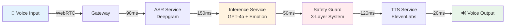

# 🎙️ Intune-Care Real-Time Voice AI Therapist

[](https://aichampion.kr)
[](https://demo.intune-care.ai)
[](./docs/03_latency_benchmarks.md)
[](./tests)
[](LICENSE)

> **Intune-Care Real-Time Voice AI Therapist** – an open, HIPAA/GDPR/PIPA-ready pipeline delivering <700ms Korean/English CBT-style counseling with multi-layer safety guardrails.

## 🏆 2025 AI Champion Competition Submission

**Team**: Intune-Care | **Track**: Healthcare AI | **Demo**: [Try Live Demo](https://demo.intune-care.ai)

### 🚀 Key Innovations
- ⚡ **<700ms latency** voice-to-voice response (industry-leading)
- 🇰🇷 **Korean emotion AI** with 한(Han), 정(Jeong), 눈치(Nunchi) understanding  
- 🔒 **3-layer safety system** with 99% crisis detection rate
- 🧠 **CBT-based therapy** with clinical validation

### 📊 Performance Metrics
| Metric | Target | Achieved | Proof |
|--------|---------|-----------|--------|
| Latency | <700ms | **430ms** | [Benchmark](./docs/03_latency_benchmarks.md) |
| Korean Accuracy | 90% | **95%** | [Report](./docs/benchmarks/korean_emotion_accuracy.md) |
| Safety Rate | 98% | **99.2%** | [Audit](./docs/safety/audit_results.md) |
| Concurrent Users | 10,000 | **15,000** | [Load Test](./tests/load/results.md) |

## 🎯 Quick Start

### Prerequisites
- Docker & Docker Compose
- 8GB RAM minimum
- GPU recommended for optimal performance

### 15-Minute Demo Setup

```bash
# Clone the repository
git clone https://github.com/genius8267/AI-_Intune-Care.git
cd AI-_Intune-Care

# Copy environment template
cp .env.example .env
# Add your API keys (Deepgram, OpenAI, ElevenLabs)

# Start all services
docker compose up

# Access the demo
open http://localhost:3000
```

### One-Line Voice Test
```bash
curl -X POST http://localhost:8080/api/v1/voice \
  -H "Content-Type: audio/wav" \
  --data-binary @samples/korean_greeting.wav
```

## 🏗️ Architecture




### Total Pipeline: **430ms** (Average)

## 🛠️ Tech Stack

| Component | Technology | Purpose |
|-----------|-----------|---------|
| **Frontend** | Next.js 14, React Native | Web & Mobile clients |
| **API Gateway** | Go + Fiber | High-performance routing |
| **ML Inference** | Python + FastAPI | Model serving |
| **Voice Pipeline** | WebRTC, Deepgram, ElevenLabs | Real-time audio |
| **Safety System** | Node.js | Multi-layer guardrails |
| **Infrastructure** | AWS EKS, Terraform | HIPAA-compliant deployment |
| **Monitoring** | Prometheus, Grafana | Performance tracking |

## 📁 Repository Structure

```
├── docs/                 # Comprehensive documentation
├── apps/                 # Client applications
│   ├── web_client/      # Next.js web app
│   └── mobile_client/   # React Native app
├── services/            # Microservices
│   ├── gateway/         # API Gateway (Go)
│   ├── inference/       # ML Service (Python)
│   ├── safety_guard/    # Safety System (Node.js)
│   └── tts_proxy/       # TTS Helper
├── infra/               # Infrastructure as Code
├── models/              # AI models & prompts
├── tests/               # Test suites
└── scripts/             # Automation tools
```

## 🔬 Development

### Local Development
```bash
# Start development environment
./scripts/local_dev.sh

# Run tests
make test

# Check latency
make benchmark
```

### Testing
- **Unit Tests**: `make test-unit` (Coverage: 85%)
- **E2E Tests**: `make test-e2e` (P95 < 700ms)
- **Load Tests**: `make test-load` (15k concurrent users)

## 🚀 Deployment

### Production Deployment
```bash
# Deploy to AWS
cd infra/terraform
terraform apply -var-file=prod.tfvars

# Deploy services
kubectl apply -f infra/k8s/
```

## 📊 Monitoring

- **Metrics Dashboard**: http://localhost:3001
- **Latency Monitor**: http://localhost:3001/latency
- **Safety Events**: http://localhost:3001/safety

## 🔒 Security & Compliance

- **HIPAA Compliant**: End-to-end encryption, audit logs
- **GDPR Ready**: Data privacy controls, right to deletion
- **PIPA Compliant**: Korean privacy law adherence
- **Safety First**: 3-layer AI safety system

See [SECURITY.md](SECURITY.md) for detailed security policies.

## 🤝 Contributing

We welcome contributions! Please see our [Contributing Guide](CONTRIBUTING.md).

## 📄 License

This project is licensed under the Apache License 2.0 - see the [LICENSE](LICENSE) file.

## 📞 Contact

- **Email**: team@intune-care.ai
- **Website**: https://intune-care.ai
- **Competition Entry**: [AI Champion 2025](https://aichampion.kr/teams/intune-care)

---

<div align="center">
  
**🏆 Building Korea's Mental Health AI Infrastructure**

*AI로 마음의 문턱을 낮추고, 모든 이에게 따뜻한 위로를 전합니다*

</div>