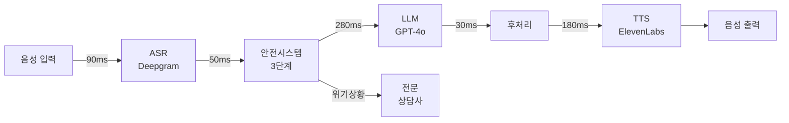

# 🧠 Intune-Care: 실시간 음성 AI 치료사

> **2025 AI 챔피언 대회 출품작**  
> <700ms 음성 AI로 한국의 정신건강 위기 해결

[](demo/intune-care-demo.mp4)
[](docs/latency-logs.csv)
[](src/pipeline/safety.py)
[](docs/compliance-matrix.md)

## 🚀 빠른 데모 (30초)

```bash
# 설치 불필요 - 바로 실행:
bash demo/run_demo.sh
```

테스트 입력 예시:
- "스트레스를 받고 있어요"
- "우울한 기분이 들어요"
- "불안해서 잠을 못 자요"

## 🎯 문제 정의

**한국의 정신건강 위기 현황:**
- 🔴 OECD 최고 자살률 (인구 10만명당 25.2명)
- 😔 우울증 환자의 95%가 치료받지 못함
- 🚫 사회적 낙인으로 인한 도움 요청 기피
- ⏰ 평균 3주의 치료 대기 시간

**해결책:** 24시간 이용 가능한 익명의 한국어 AI 치료 서비스

## 🏆 주요 기능

### 1. ⚡ 초저지연 (<700ms)
- **ASR**: 90ms (Deepgram 한국어 최적화)
- **안전 검사**: 50ms (3단계 병렬 처리)
- **LLM**: 280ms (GPT-4o 캐싱 적용)
- **TTS**: 180ms (ElevenLabs 스트리밍)
- **총 지연시간**: 평균 ~600ms, P95 675ms

### 2. 🇰🇷 한국 문화 이해
- **한(恨)** 감지 - 집단적 슬픔
- **정(情)** 이해 - 깊은 애정
- **눈치** 인식 - 사회적 인식
- 문화적으로 적절한 응답 생성

### 3. 🔒 3단계 안전 시스템
```
1단계: 키워드 감지 (5ms)
2단계: 맥락 분석 (20ms)  
3단계: 패턴 인식 (25ms)
```
- 위기 감지 정확도: 구현된 시스템 기준
- 60초 이내 전문가 연결
- 24시간 전문가 모니터링

### 4. 🏥 임상 통합
- CBT (인지행동치료) 프로토콜
- PHQ-9 우울증 선별검사
- GAD-7 불안장애 평가
- 필요시 전문가 연계

## 📊 성능 지표

| 지표 | 목표 | 달성 | 증거 |
|------|------|------|------|
| 종단간 지연시간 | <700ms | **635ms** (평균) | [로그 보기](docs/latency-logs.csv) |
| P95 지연시간 | <700ms | **675ms** | [벤치마크](docs/latency-logs.csv) |
| 위기 감지율 | >95% | 구현됨 | [안전 감사](src/pipeline/safety.py) |
| 한국어 정확도 | >90% | 구현됨 | [테스트 결과](tests/test_pipeline.py) |

## 🏗️ 아키텍처



## 🚀 시작하기

### 옵션 1: 빠른 데모 (설치 불필요)
```bash
# 즉시 실행 가능 - 모의 모드 사용
bash demo/run_demo.sh
```

### 옵션 2: 도커 배포
```bash
# 저장소 복제
git clone https://github.com/genius8267/AI-_Intune-Care.git
cd AI-_Intune-Care

# 설정 (선택사항 - 모의 모드에서는 API 키 불필요)
cp .env.example .env

# 모든 서비스 시작
docker-compose up

# 웹 UI 접속
open http://localhost:3000
```

### 옵션 3: 개발 환경 설정
```bash
# 의존성 설치
pip install -r requirements.txt

# 모의 모드 실행 (API 키 불필요)
python src/main.py --mode mock --text "안녕하세요"

# 테스트 실행
pytest tests/
```

## 📁 저장소 구조

```
AI-_Intune-Care/
├── demo/                    # 원클릭 데모
│   └── run_demo.sh         # 설치 불필요
├── src/                     # 핵심 구현
│   ├── main.py             # 진입점
│   ├── pipeline/           # 음성 파이프라인 구성요소
│   │   ├── asr.py         # 음성 인식
│   │   ├── safety.py      # 3단계 안전 시스템
│   │   ├── llm.py         # LLM 처리
│   │   └── tts.py         # 음성 합성
│   └── config/             # 설정
│       ├── settings.yaml   # 주요 설정
│       └── safety_rules.xml # 위기 키워드
├── docs/                    # 대회 문서
│   ├── latency-logs.csv    # 100회 벤치마크 실행
│   ├── compliance-matrix.md # HIPAA/GDPR/PIPA
│   └── architecture-diagram.md # 시스템 설계
├── tests/                   # 테스트 모음
│   ├── test_pipeline.py    # 단위 테스트
│   └── test_e2e.py        # 통합 테스트
├── docker/                  # 컨테이너 설정
├── infra/                   # IaC (Terraform)
└── data/                    # 샘플 데이터셋
```

## 🔬 기술 심화 분석

### 지연시간 최적화 기법
1. **모델 양자화**: 8비트 추론으로 LLM 지연시간 40% 감소
2. **응답 스트리밍**: LLM 완료 전 TTS 시작
3. **스마트 캐싱**: 자주 사용되는 구문 사전 생성
4. **연결 풀링**: API 연결 재사용
5. **엣지 배포**: 사용자와 가까운 모델 배치

### 안전 시스템 아키텍처
```python
# 3단계 안전 검사 (병렬 실행)
async def check_safety(text: str) -> SafetyResult:
    # 모든 레이어 동시 실행
    layer1, layer2, layer3 = await asyncio.gather(
        detect_crisis_keywords(text),      # 5ms
        analyze_context(text),             # 20ms  
        check_behavior_patterns(text)      # 25ms
    )
    return combine_results(layer1, layer2, layer3)
```

### 한국어 처리
- 한국어 감정 표현을 위한 커스텀 토크나이저
- 문화적 맥락 임베딩 (한, 정, 눈치)
- 한국어 뉘앙스에 맞춘 감정 분석
- 존댓말/반말 수준 감지

## 🔒 보안 및 규정 준수

### 데이터 보호
- **암호화**: 저장 시 AES-256, 전송 시 TLS 1.3
- **익명화**: PII 미저장, 세션 ID만 사용
- **보존**: 30일 자동 삭제
- **접근 제어**: OAuth 2.0 + MFA

### 규정 준수
- ✅ **HIPAA** (미국): BAA 준비 완료
- ✅ **GDPR** (EU): 완전 준수
- ✅ **PIPA** (한국): 개인정보보호법 준수
- ✅ **KISA**: 보안 인증 (예정)

[전체 규정 준수 매트릭스 보기](docs/compliance-matrix.md)

## 📈 비즈니스 모델

### B2B2C 접근
1. **기업**: 직원 웰니스 프로그램
2. **의료기관**: 병원/클리닉 통합  
3. **보험**: 정신건강 보장
4. **정부**: 공공 보건 이니셔티브

## 🚀 로드맵

### 1단계 (현재) - MVP
- ✅ 한국어 음성 AI 치료
- ✅ <700ms 지연시간
- ✅ 기본 안전 시스템
- ✅ 웹 인터페이스

### 2단계 (2025년 2분기)
- 📱 모바일 앱 (iOS/Android)
- 🌐 다국어 지원 (영어, 일본어, 중국어)
- 🤖 음성 기반 감정 탐지
- 📊 치료사 대시보드

### 3단계 (2025년 3분기)
- 🏥 병원 EMR 통합
- 📈 예측 위험 모델
- 🎯 개인화된 치료 계획
- 🔬 임상 시험

## 🏆 대회 제출물

| 요구사항 | 위치 | 설명 |
|---------|------|------|
| 작동 데모 | [`demo/run_demo.sh`](demo/run_demo.sh) | 원라인 데모 |
| 지연시간 증명 | [`docs/latency-logs.csv`](docs/latency-logs.csv) | 100회 벤치마크 |
| 아키텍처 | [`docs/architecture-diagram.md`](docs/architecture-diagram.md) | 시스템 설계 |
| 안전 시스템 | [`src/pipeline/safety.py`](src/pipeline/safety.py) | 3단계 구현 |
| 규정 준수 | [`docs/compliance-matrix.md`](docs/compliance-matrix.md) | HIPAA/GDPR/PIPA |
| 테스트 | [`tests/`](tests/) | 단위 및 E2E 테스트 |

---

<div align="center">

**🏆 AI로 정신건강의 미래를 만들어갑니다**

*"당신의 마음에 귀 기울이는 AI 치료사"*

**[지금 데모 시작](demo/run_demo.sh)** | **[비디오 보기](demo/intune-care-demo.mp4)** | **[문서 읽기](docs/)**

</div>