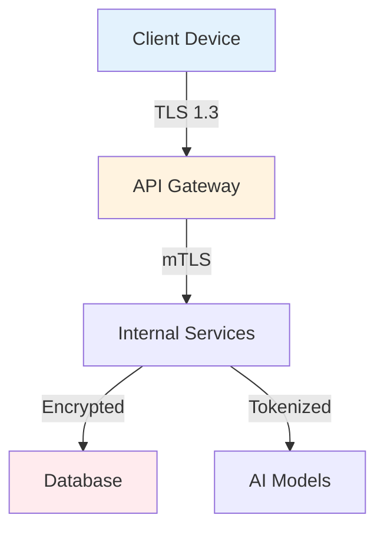

# Security Policy

## 🔒 Security Standards

Intune-Care is committed to maintaining the highest security standards for mental health data protection.

### Compliance
- **HIPAA** (Health Insurance Portability and Accountability Act)
- **GDPR** (General Data Protection Regulation)
- **PIPA** (Personal Information Protection Act - Korea)

## 🛡️ Data Protection

### Encryption
- **In Transit**: TLS 1.3 for all API communications
- **At Rest**: AES-256 encryption for stored data
- **End-to-End**: Voice streams encrypted with WebRTC DTLS-SRTP

### Data Flow Diagram

## 🚨 Vulnerability Reporting

We take security vulnerabilities seriously. If you discover a security issue, please report it responsibly.

### Reporting Process

1. **DO NOT** create a public GitHub issue
2. Email security@intune-care.ai with:
   - Description of the vulnerability
   - Steps to reproduce
   - Potential impact
   - Your contact information

### Response Timeline
- **Acknowledgment**: Within 24 hours
- **Initial Assessment**: Within 72 hours
- **Resolution Target**: Based on severity (Critical: 7 days, High: 14 days, Medium: 30 days)

## 🔐 Security Measures

### Authentication & Authorization
- OAuth 2.0 / OpenID Connect
- JWT tokens with short expiration (15 minutes)
- Refresh token rotation
- Multi-factor authentication available

### API Security
- Rate limiting: 100 requests/minute per user
- API key rotation every 90 days
- Request signing with HMAC-SHA256
- Input validation on all endpoints

### Infrastructure Security
- AWS VPC with private subnets
- Network segmentation
- WAF (Web Application Firewall)
- DDoS protection
- Regular security patching

## 🧪 Security Testing

### Automated Scanning
- **Dependencies**: Daily vulnerability scanning with Dependabot
- **Container Images**: Trivy scanning in CI/CD
- **Code**: SAST with Semgrep and Bandit
- **Infrastructure**: Terraform security scanning

### Manual Testing
- Quarterly penetration testing
- Annual third-party security audit
- Regular security training for developers

## 📋 Security Checklist for Contributors

- [ ] No hardcoded secrets or credentials
- [ ] All user inputs are validated and sanitized
- [ ] Sensitive data is never logged
- [ ] Dependencies are up-to-date
- [ ] Code follows OWASP secure coding practices
- [ ] New endpoints have rate limiting
- [ ] Database queries use parameterized statements

## 🚦 Incident Response

### Severity Levels
- **Critical**: Data breach, system compromise
- **High**: Authentication bypass, data exposure risk
- **Medium**: Security misconfiguration
- **Low**: Best practice violations

### Response Team
- Security Lead: security@intune-care.ai
- On-call rotation for 24/7 coverage
- Escalation to executive team for Critical issues

## 📊 Third-Party Dependencies

All third-party dependencies undergo security review:

| Component | License | Security Review |
|-----------|---------|----------------|
| Next.js | MIT | ✅ Passed |
| React Native | MIT | ✅ Passed |
| Go Fiber | MIT | ✅ Passed |
| FastAPI | MIT | ✅ Passed |
| Deepgram SDK | Proprietary | ✅ SOC2 Compliant |
| OpenAI API | Proprietary | ✅ SOC2 Compliant |
| ElevenLabs | Proprietary | ✅ GDPR Compliant |

## 🔍 Audit Trail

All security-relevant events are logged:
- Authentication attempts
- Data access
- Configuration changes
- API calls
- Error events

Logs are retained for 1 year and stored in tamper-proof storage.

## 📞 Contact

- **Security Team**: security@intune-care.ai
- **Bug Bounty Program**: Coming soon
- **Compliance Questions**: compliance@intune-care.ai

---

Last Updated: January 2025
Version: 1.0