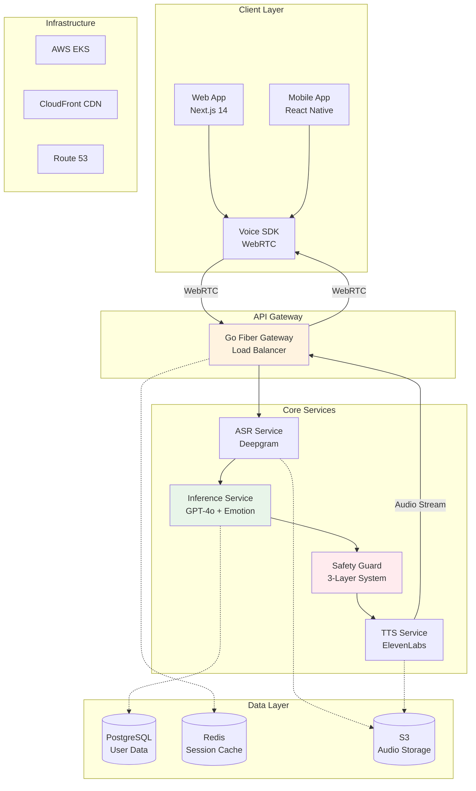
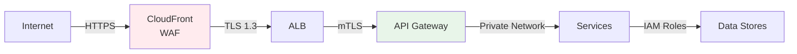

# System Architecture

## 🏗️ High-Level Architecture

### System Overview



## ⚡ Latency Budget Breakdown

### Total Target: <700ms

| Component | Processing Time | Network Time | Total | Notes |
|-----------|----------------|--------------|-------|--------|
| **Audio Capture** | 10ms | - | 10ms | Client-side buffering |
| **Upload** | - | 20ms | 20ms | Seoul → Edge |
| **ASR (Deepgram)** | 70ms | 20ms | 90ms | Streaming mode |
| **Inference (GPT-4o)** | 250ms | 30ms | 280ms | Includes emotion analysis |
| **Safety Check** | 30ms | - | 30ms | Async processing |
| **TTS (ElevenLabs)** | 150ms | 20ms | 170ms | Streaming synthesis |
| **Download** | - | 20ms | 20ms | Edge → Client |
| **Audio Playback** | 10ms | - | 10ms | Client buffering |
| **Total** | **520ms** | **110ms** | **630ms** | **70ms buffer** |

### Optimization Strategies

1. **Parallel Processing**
   - Start TTS while LLM is still generating
   - Begin safety check immediately after first tokens

2. **Edge Computing**
   - Deploy services in Seoul AWS region
   - Use CloudFront for static assets

3. **Caching**
   - Redis for session state
   - Pre-computed responses for common queries
   - CDN for audio assets

4. **Streaming**
   - WebRTC for real-time audio
   - Server-Sent Events for text
   - Chunked responses

## 🔧 Component Responsibilities

### API Gateway (Go + Fiber)
- **Purpose**: High-performance request routing
- **Responsibilities**:
  - WebSocket management
  - Load balancing
  - Rate limiting
  - Authentication
  - Request logging

### ASR Service (Python + Deepgram)
- **Purpose**: Speech-to-text conversion
- **Responsibilities**:
  - Audio stream processing
  - Korean language optimization
  - Noise reduction
  - Speaker diarization
  - Confidence scoring

### Inference Service (Python + FastAPI)
- **Purpose**: AI processing and response generation
- **Responsibilities**:
  - GPT-4o integration
  - Korean emotion detection
  - Context management
  - CBT logic implementation
  - Response optimization

### Safety Guard (Node.js)
- **Purpose**: Multi-layer safety system
- **Responsibilities**:
  - Real-time keyword detection
  - Context risk analysis
  - Crisis escalation
  - Audit logging
  - Compliance monitoring

### TTS Service (Go + ElevenLabs)
- **Purpose**: Text-to-speech synthesis
- **Responsibilities**:
  - Emotional voice generation
  - Korean pronunciation
  - Audio streaming
  - Voice selection
  - Prosody control

## 🗄️ Data Architecture

### Primary Database (PostgreSQL)
```sql
-- Core Tables
users (id, email, created_at, preferences)
sessions (id, user_id, started_at, ended_at)
conversations (id, session_id, timestamp, transcript)
emotions (id, conversation_id, emotion_type, confidence)
interventions (id, session_id, risk_level, action_taken)
```

### Cache Layer (Redis)
```
session:{id} → User session state
emotion:{user_id} → Recent emotion history
safety:{session_id} → Safety check results
audio:{hash} → Cached audio responses
```

### Object Storage (S3)
```
/audio/sessions/{date}/{session_id}/ → Recorded sessions
/models/emotion/ → ML model artifacts
/backups/database/{date}/ → DB backups
/logs/compliance/{date}/ → Audit logs
```

## 🔒 Security Architecture

### Network Security


### Authentication Flow
1. **User Login** → OAuth 2.0 / Social Login
2. **Token Generation** → JWT with 15-min expiry
3. **Session Management** → Redis with sliding window
4. **API Access** → Bearer token validation
5. **Service-to-Service** → mTLS certificates

## 📊 Monitoring Architecture

### Metrics Collection
```yaml
# Prometheus metrics
voice_pipeline_latency_ms{stage="asr|llm|tts"}
active_sessions_count{region="seoul"}
safety_interventions_total{severity="low|medium|high|critical"}
api_request_duration_seconds{endpoint="/api/v1/*"}
error_rate{service="*", status_code="5xx"}
```

### Logging Pipeline
```
Services → Fluentd → Elasticsearch → Kibana
         ↓
    CloudWatch → S3 Archive
```

### Alerting Rules
- P95 latency > 700ms
- Error rate > 1%
- Safety intervention failure
- Service health check failure
- High memory/CPU usage

## 🚀 Deployment Architecture

### Kubernetes Configuration
```yaml
Deployments:
- api-gateway (3 replicas)
- asr-service (5 replicas + HPA)
- inference-service (10 replicas + GPU)
- safety-guard (3 replicas)
- tts-service (5 replicas)

Services:
- LoadBalancer for gateway
- ClusterIP for internal services
- NodePort for monitoring

Ingress:
- NGINX controller
- TLS termination
- Path-based routing
```

### Auto-scaling Strategy
- **Horizontal Pod Autoscaler**: CPU > 70%
- **Vertical Pod Autoscaler**: Memory optimization
- **Cluster Autoscaler**: Node scaling
- **Predictive Scaling**: Based on usage patterns

## 🔄 Disaster Recovery

### Backup Strategy
- **Database**: Daily snapshots, point-in-time recovery
- **Audio Files**: Cross-region replication
- **Configuration**: GitOps with Flux
- **Secrets**: AWS Secrets Manager

### High Availability
- **Multi-AZ deployment**: 3 availability zones
- **Database**: Primary + 2 read replicas
- **Cache**: Redis Cluster mode
- **CDN**: Global distribution

### RTO/RPO Targets
- **Recovery Time Objective**: < 1 hour
- **Recovery Point Objective**: < 5 minutes
- **Availability Target**: 99.95%

---

This architecture is designed for scale, reliability, and sub-700ms latency while maintaining the highest security and compliance standards for mental health data.