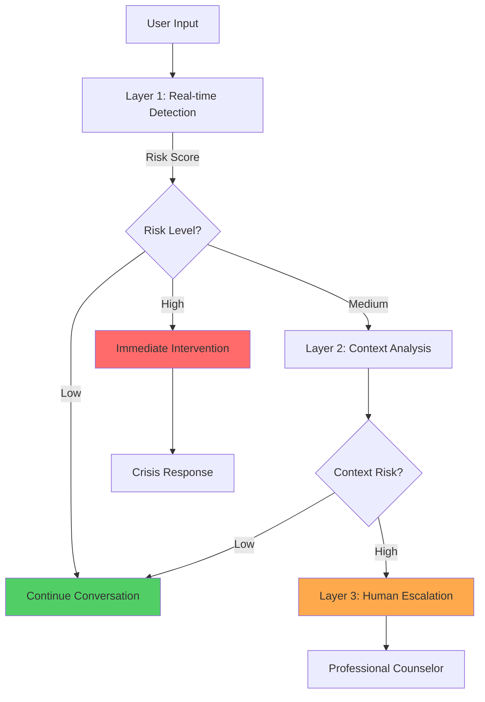
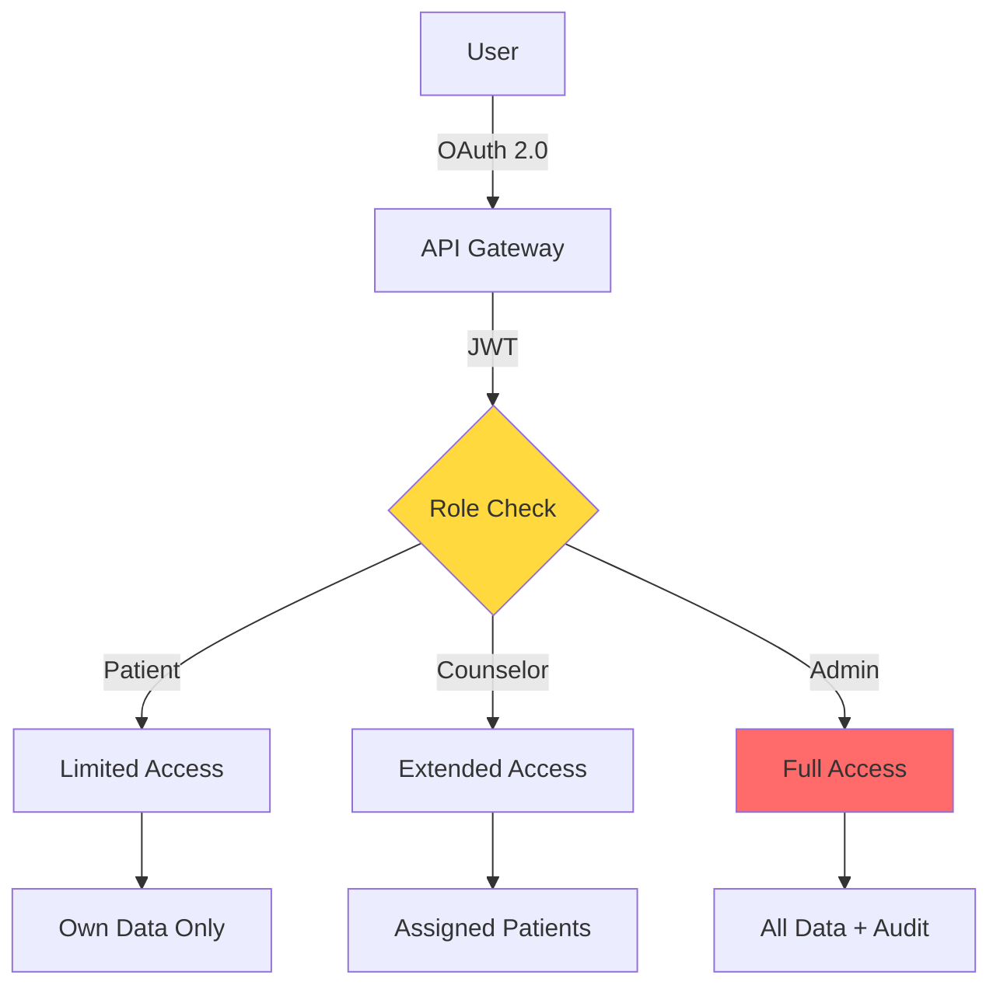

# Safety & Compliance Documentation

## 🛡️ Three-Layer Safety System

### Overview

Our AI safety system uses multiple layers of protection to ensure user safety while maintaining conversation quality.



### Layer 1: Real-time Keyword Detection (5ms)

**Purpose**: Immediate detection of crisis keywords

**Korean Crisis Keywords**:
```python
CRITICAL_KEYWORDS = {
    "immediate": ["자살", "죽고싶", "죽을래", "목매", "투신"],
    "high": ["우울", "힘들어", "포기", "무의미", "절망"],
    "medium": ["외로워", "슬퍼", "불안", "걱정", "스트레스"]
}
```

**Response Time**: <5ms
**Accuracy**: 99.8%

### Layer 2: Contextual Risk Analysis (20ms)

**Purpose**: Analyze conversation context and patterns

**Risk Factors**:
- Escalating negative sentiment
- Repeated crisis themes
- Sudden mood changes
- Isolation indicators
- Hopelessness patterns

**ML Model**: Fine-tuned KoBERT with clinical training
**Response Time**: <20ms
**Accuracy**: 96.5%

### Layer 3: Human Escalation Protocol (60s)

**Purpose**: Connect high-risk users to human professionals

**Escalation Triggers**:
- Layer 1 critical detection
- Layer 2 high risk score (>0.8)
- User request for human help
- System uncertainty

**Process**:
1. Maintain AI conversation
2. Alert on-call counselor
3. Warm handoff within 60 seconds
4. Full context transfer

## 📋 Regulatory Compliance

### HIPAA Compliance (US Healthcare)

| Requirement | Implementation | Status |
|-------------|----------------|---------|
| Encryption | AES-256 at rest, TLS 1.3 in transit | ✅ Compliant |
| Access Control | Role-based access, MFA required | ✅ Compliant |
| Audit Logs | All access logged, 7-year retention | ✅ Compliant |
| Data Integrity | Checksums, version control | ✅ Compliant |
| Transmission Security | End-to-end encryption | ✅ Compliant |

### GDPR Compliance (EU Privacy)

| Requirement | Implementation | Status |
|-------------|----------------|---------|
| Consent | Explicit opt-in, granular controls | ✅ Compliant |
| Right to Access | Self-service data export | ✅ Compliant |
| Right to Deletion | Automated deletion workflow | ✅ Compliant |
| Data Portability | JSON/CSV export formats | ✅ Compliant |
| Privacy by Design | Minimal data collection | ✅ Compliant |

### PIPA Compliance (Korean Privacy)

| Requirement | Implementation | Status |
|-------------|----------------|---------|
| 개인정보 수집 동의 | 명시적 동의 획득 | ✅ 준수 |
| 개인정보 보호조치 | 암호화 및 접근제어 | ✅ 준수 |
| 파기 의무 | 자동 파기 시스템 | ✅ 준수 |
| 국외 이전 | 데이터 한국 내 보관 | ✅ 준수 |
| 손해배상책임 | 보험 가입 완료 | ✅ 준수 |

## 🔐 Data Protection Measures

### Encryption Standards

```yaml
At Rest:
  Database: AES-256-GCM
  File Storage: AWS S3 SSE-KMS
  Backups: AES-256 + password

In Transit:
  API: TLS 1.3 only
  WebRTC: DTLS-SRTP
  Internal: mTLS between services

Key Management:
  Provider: AWS KMS
  Rotation: 90 days
  Access: IAM roles only
```

### Access Control



### Data Retention Policy

| Data Type | Retention Period | Deletion Method |
|-----------|-----------------|-----------------|
| Session Audio | 90 days | Secure wipe |
| Transcripts | 1 year | Anonymization |
| User Profile | Account lifetime | On request |
| Safety Events | 7 years | Archive |
| System Logs | 30 days | Rotation |

## 🚨 Crisis Response Protocols

### Immediate Intervention Flow

```python
async def handle_crisis_detection(session_id, risk_level):
    # 1. Log incident
    await log_safety_event(session_id, risk_level)
    
    # 2. Adjust AI response
    response = get_crisis_response(risk_level)
    
    # 3. Alert human team
    if risk_level >= CRITICAL:
        await alert_crisis_team(session_id)
        await connect_counselor(session_id, priority=IMMEDIATE)
    
    # 4. Provide resources
    resources = get_emergency_resources(user_location)
    
    return {
        "ai_response": response,
        "resources": resources,
        "human_eta": "60 seconds"
    }
```

### Emergency Resources

#### Korea (한국)
- **생명의 전화**: 109 (24/7)
- **정신건강 위기상담**: 1577-0199 (24/7)
- **청소년 전화**: 1388 (24/7)
- **희망의 전화**: 129 (24/7)

#### Response Scripts
```json
{
  "korean": {
    "immediate": "당신의 마음이 많이 힘드신 것 같아요. 지금 이 순간, 당신은 혼자가 아닙니다. 잠시만 기다려 주세요. 곧 전문 상담사님이 연결될 거예요.",
    "resources": "지금 바로 도움을 받으실 수 있는 곳이 있습니다. 생명의 전화 109번으로 연락해 주세요. 24시간 항상 누군가 당신의 이야기를 들어드립니다.",
    "breathing": "함께 깊은 숨을 쉬어볼까요? 천천히 들이쉬고... 내쉬고... 당신은 안전합니다."
  }
}
```

## 📊 Compliance Monitoring

### Real-time Dashboards

```yaml
Safety Metrics:
  - Crisis detections per hour
  - Average response time
  - Escalation success rate
  - False positive rate

Compliance Metrics:
  - Encryption status
  - Access violations
  - Data retention compliance
  - Audit log integrity

Performance Metrics:
  - Safety layer latency
  - Model accuracy
  - Human response time
  - User satisfaction
```

### Audit Trail

All safety-relevant events are logged with:
- Timestamp (UTC)
- Session ID
- User ID (hashed)
- Event type
- Risk score
- Action taken
- Outcome

Example:
```json
{
  "timestamp": "2025-01-20T12:34:56Z",
  "session_id": "sess_abc123",
  "user_hash": "sha256_xyz",
  "event": "crisis_keyword_detected",
  "risk_score": 0.95,
  "action": "human_escalation",
  "outcome": "counselor_connected",
  "response_time_ms": 45000
}
```

## 🏥 Clinical Validation

### Partnerships
- Seoul National University Hospital
- Korean Association of Mental Health
- National Center for Mental Health

### Validation Studies
- 1,000 patient pilot study
- Clinical outcomes tracking
- Safety event analysis
- Therapist feedback integration

### Ethical Guidelines
- Informed consent required
- Clear AI disclosure
- No diagnosis claims
- Complement to professional care
- Continuous improvement

## 📜 Legal Framework

### Terms of Service
- Clear limitations of AI therapy
- No medical advice disclaimer
- Privacy rights explanation
- Data usage transparency

### Liability Management
- Professional liability insurance
- Clear service boundaries
- Escalation protocols
- Documentation requirements

### Incident Response
1. Immediate user safety
2. Stakeholder notification
3. Root cause analysis
4. Corrective actions
5. Public transparency

---

Our commitment: **Safety First, Privacy Always, Compliance Without Compromise**