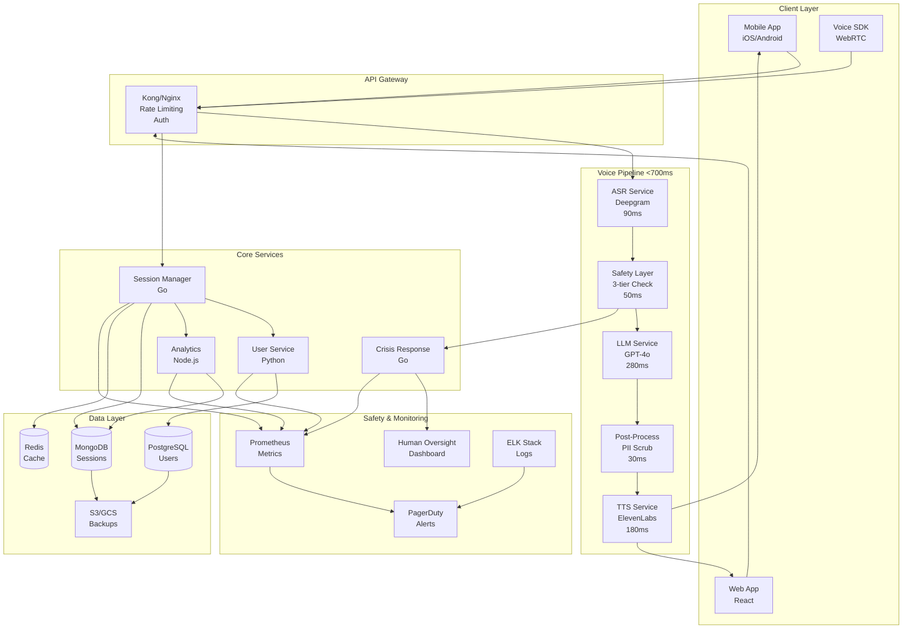
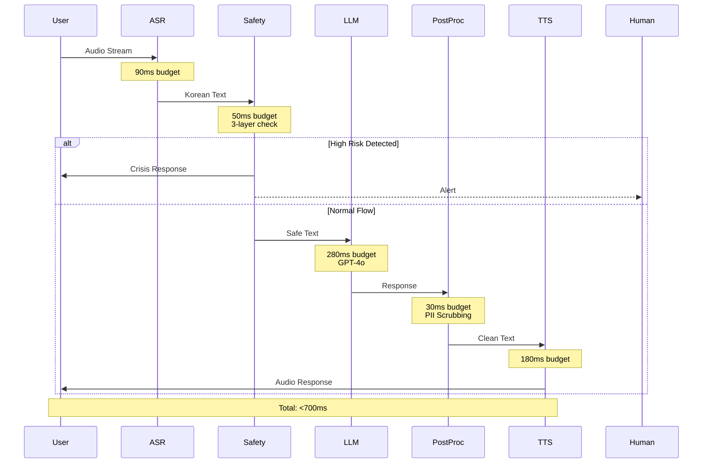
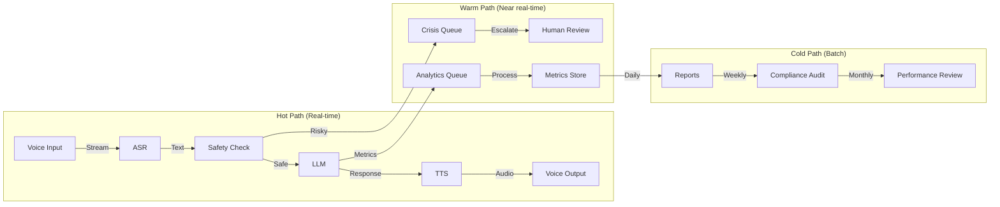
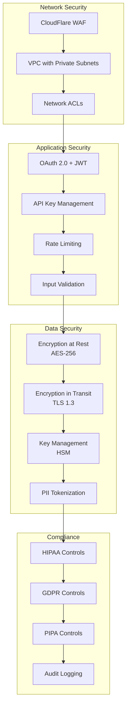
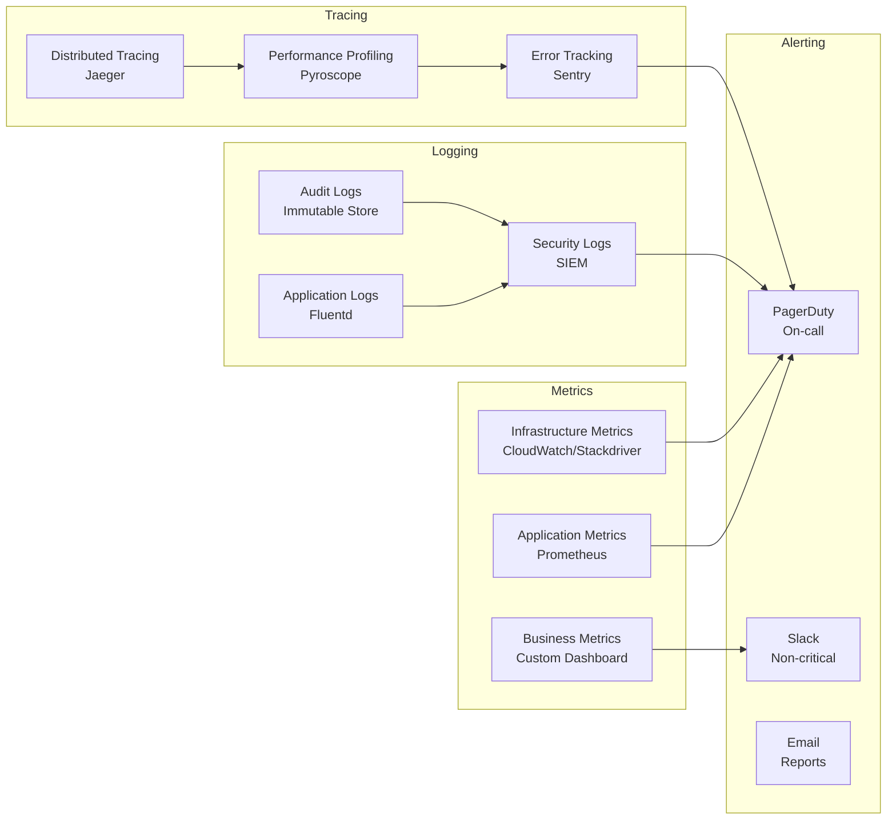
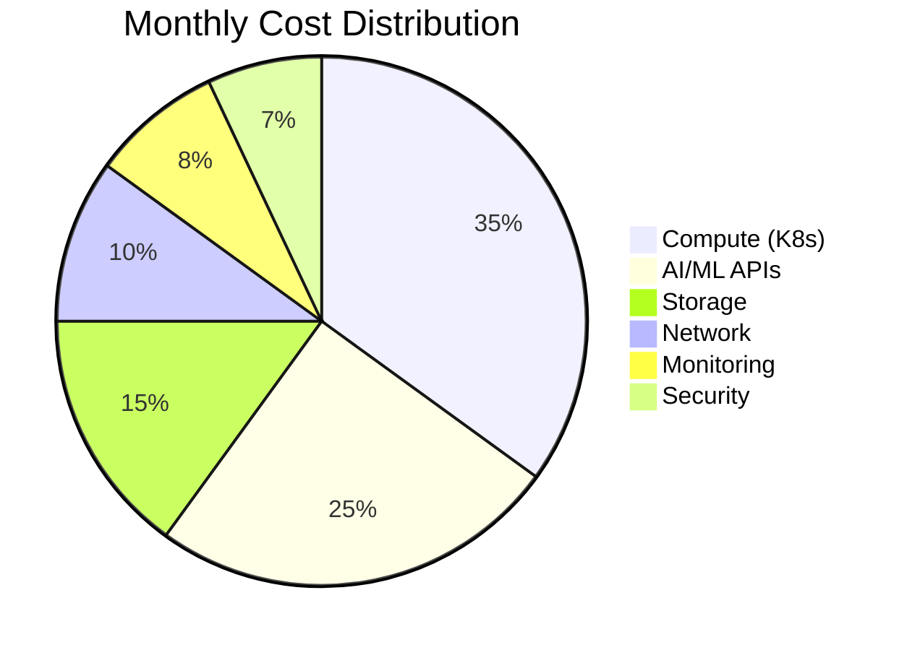

# Architecture Diagram - Intune-Care Voice AI Therapist

## System Overview



## Component Details

### 1. Client Layer
- **Mobile Apps**: Native iOS (Swift) and Android (Kotlin) with voice UI
- **Web App**: React-based interface for desktop users
- **Voice SDK**: WebRTC for low-latency audio streaming

### 2. API Gateway (Kong/Nginx)
- **Authentication**: JWT tokens with refresh mechanism
- **Rate Limiting**: 100 requests/minute per user
- **Load Balancing**: Round-robin with health checks
- **SSL Termination**: TLS 1.3 only

### 3. Voice Pipeline Architecture



### 4. Microservices Architecture

```yaml
services:
  session_manager:
    language: Go
    responsibilities:
      - WebSocket management
      - State persistence
      - Pipeline orchestration
    scaling: Horizontal (1-100 pods)
    
  user_service:
    language: Python
    framework: FastAPI
    responsibilities:
      - Authentication
      - User profiles
      - Consent management
    database: PostgreSQL
    
  analytics_service:
    language: Node.js
    framework: Express
    responsibilities:
      - Usage metrics
      - Performance tracking
      - Compliance reporting
    storage: MongoDB + ClickHouse
    
  crisis_response:
    language: Go
    priority: P0
    responsibilities:
      - Real-time intervention
      - Human escalation
      - Emergency protocols
    sla: 99.99% uptime
```

### 5. Data Flow Diagram



### 6. Security Architecture



### 7. Deployment Architecture

```yaml
environments:
  development:
    cluster: k8s-dev (3 nodes)
    region: us-west-2
    features:
      - Feature flags
      - Debug logging
      - Mock services
      
  staging:
    cluster: k8s-staging (6 nodes)
    region: us-west-2
    features:
      - Production configs
      - Load testing
      - Security scanning
      
  production:
    clusters:
      - primary: k8s-prod-us (20 nodes)
      - secondary: k8s-prod-kr (20 nodes)
    regions:
      - us-west-2 (primary)
      - ap-northeast-2 (Seoul)
    features:
      - Auto-scaling (10-100 pods)
      - Multi-region failover
      - Zero-downtime deployment
```

### 8. Monitoring & Observability



### 9. Latency Optimization Strategies

| Component | Strategy | Impact |
|-----------|----------|--------|
| ASR | Korean-optimized model<br/>Edge deployment | -20ms |
| Safety | Bloom filter for keywords<br/>Parallel execution | -15ms |
| LLM | Response caching<br/>Streaming generation | -50ms |
| TTS | Voice pre-generation<br/>Chunk streaming | -30ms |
| Network | CDN for static assets<br/>WebSocket reuse | -25ms |

### 10. Disaster Recovery

```yaml
rpo: 1 hour  # Recovery Point Objective
rto: 15 minutes  # Recovery Time Objective

backup_strategy:
  databases:
    frequency: hourly snapshots
    retention: 30 days
    locations:
      - primary region
      - secondary region
      - offline archive
      
  configurations:
    method: GitOps
    tool: ArgoCD
    verification: Automated testing
    
failover_procedure:
  1_detection: Automated health checks (30s)
  2_decision: Automated for known failures (1m)
  3_switch: DNS update to secondary (2m)
  4_verification: End-to-end tests (2m)
  5_notification: Stakeholder alerts
```

### 11. Scalability Metrics

| Metric | Current | Target | Method |
|--------|---------|--------|--------|
| Concurrent Users | 1,000 | 100,000 | Horizontal scaling |
| Requests/Second | 500 | 50,000 | Load balancing |
| Latency P95 | 675ms | <700ms | Optimization |
| Availability | 99.9% | 99.99% | Multi-region |
| Data Storage | 1TB | 100TB | Sharding |

### 12. Cost Optimization



**Optimization Strategies**:
- Spot instances for non-critical workloads
- Reserved capacity for baseline load
- Caching to reduce API calls
- CDN for static content
- Automated resource scaling

---

**Last Updated**: 2025-01-20  
**Architecture Version**: 2.0.0  
**Next Review**: 2025-02-15